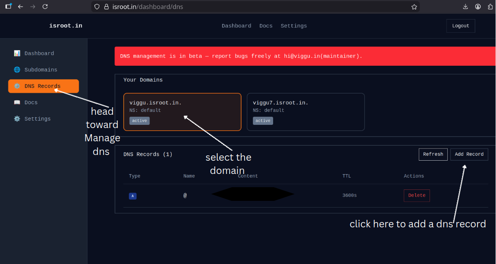

# DNS Management

This guide explains how to manage DNS records for your registered subdomains using the dashboard's **DNS → Manage DNS** interface.

---

## Overview
Use the DNS management UI to add, edit, and remove DNS records for your subdomain. Typical record types include A, CNAME, TXT, MX, and SRV.

## Steps — Manage DNS via Dashboard
1. Log in with **GitHub** and open **My Domains**.
2. Click the domain/subdomain you want to manage.
3. Choose **DNS → Manage DNS**.

4. Click **Add Record** and choose the record type.
   - **A:** Points a name to an IPv4 address (e.g., `@ -> 203.0.113.1`).
   - **CNAME:** Points a name to another name (e.g., `www -> example.com.`).
   - **TXT:** Add verification or other text records (e.g., for SPF, domain verification).
5. Enter the **Name**, **Value**, **TTL** (use default if unsure), and save.

## Examples
- Add an A record for `project.isroot.in` pointing to `203.0.113.1`.
- Add a CNAME for `www.project.isroot.in` pointing to `project.isroot.in`.
- Add a TXT record for domain verification (e.g., `google-site-verification`).

## Propagation & Verification
- DNS changes can take minutes to propagate but may take up to 24–48 hours depending on TTL and caching.
- Verify changes using `dig` or `nslookup`:
  - `dig A project.isroot.in` or `dig CNAME www.project.isroot.in`.

## Cloudflare notes
- We are not available in PSL yet, so you’ll need to wait to be onboarded to Cloudflare.
## Troubleshooting
- Record not appearing? Clear DNS cache or wait for TTL to expire.
- Wrong IP or CNAME? Double-check record values and trailing dots for CNAMEs when required.
- Nameserver mismatch? Ensure your DNS provider's nameservers are set correctly at your registrar or in the domain settings.

## Need Help?
If you run into issues, check the Troubleshooting guide or contact Support (see `Getting Started` for support links).

---
